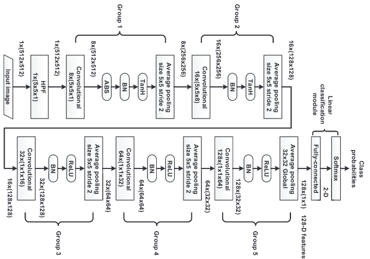

#Structural Design of Convolutional Neural Networks for Steganalysis (XuNet)#
Pytorch implementation of [Structural Design of Convolutional Neural Networks for Steganalysis (XuNet)](https://ieeexplore.ieee.org/stamp/stamp.jsp?tp=&arnumber=7444146).
Training and testing code will be made available soon.

<table>
  <tr>
     <td align="center">XuNet Architecture</td>
  </tr>
  <tr>
    <td valign="top"></td>
  </tr>
 </table>
